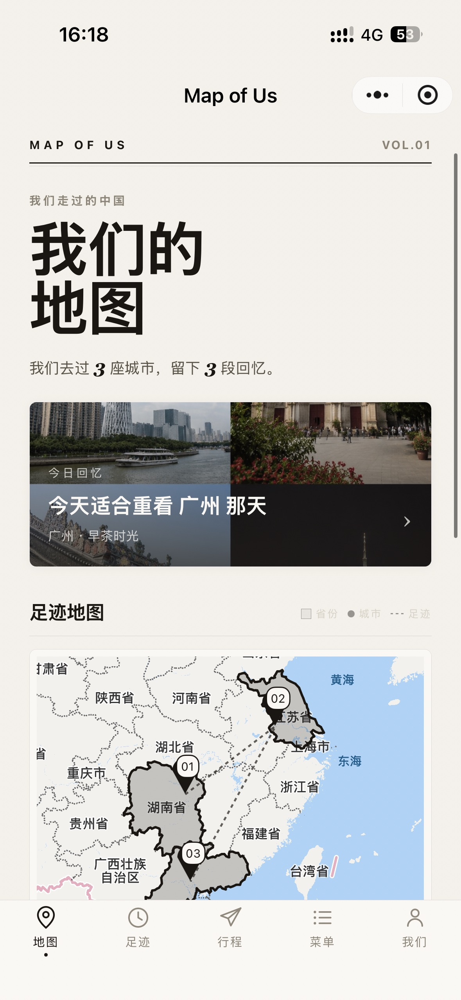
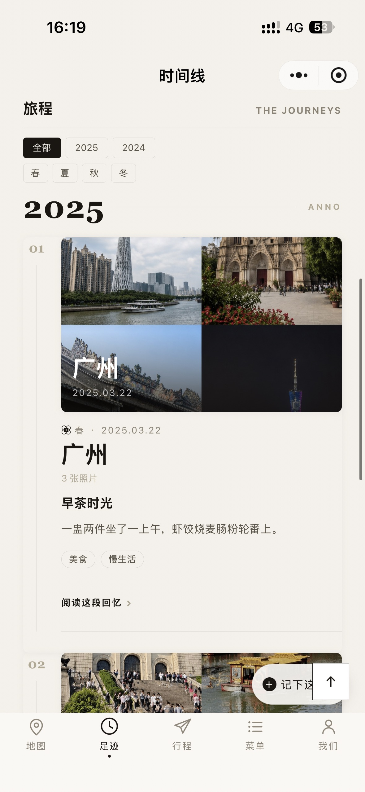
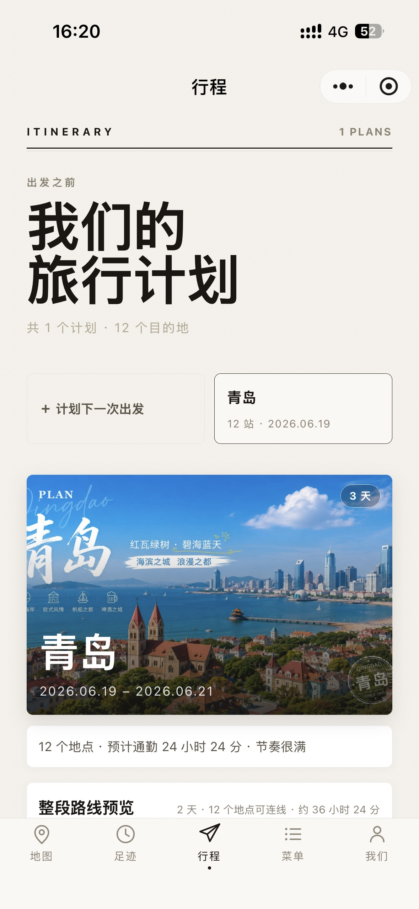
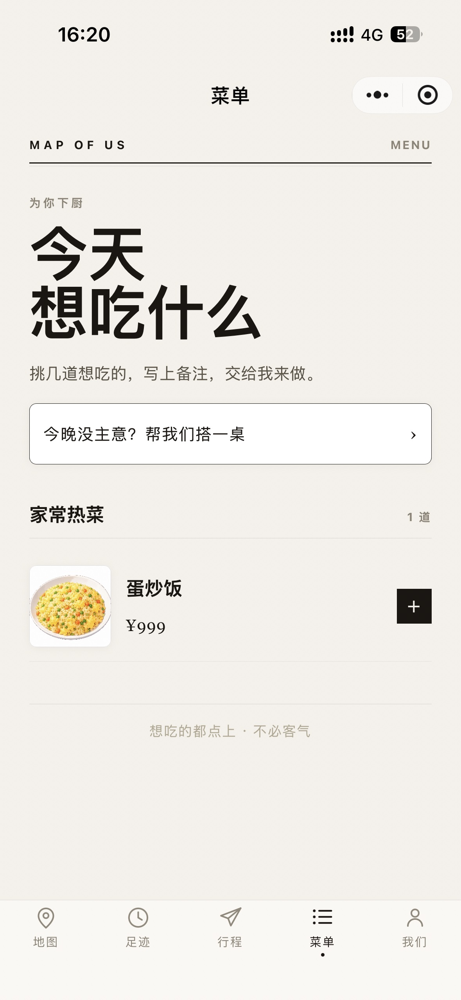
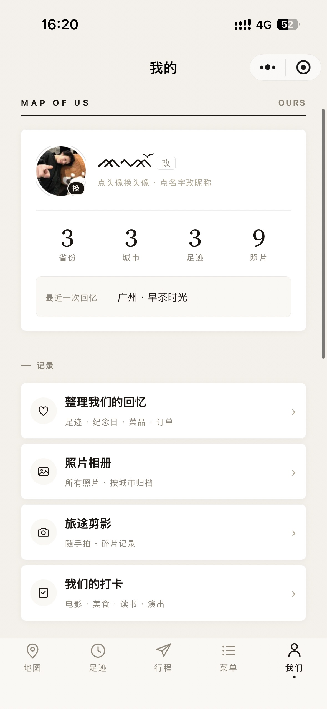
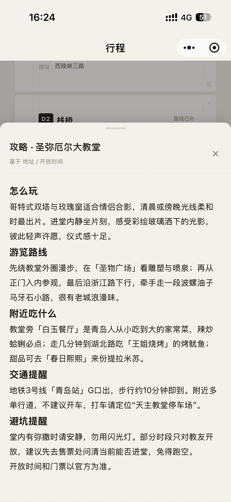

# 我们走过的地图

一款为情侣设计的旅行回忆微信小程序，用地图、照片、时间线、行程和 AI 辅助叙事，把两个人一起去过的地方整理成一份可以反复翻看的共同记忆。

## 作品简介

《我们走过的地图》以中国地图为第一入口，记录情侣共同去过的城市、旅行照片、日期天气、手记、心愿目的地和出发前计划。作品希望表达的不是“打卡工具”，而是“我们一起走过哪里、留下了什么、还想去哪里”的情感空间。

首页通过地图、今日回忆和最近足迹建立第一眼作品感；足迹详情以照片先行的方式呈现城市回忆；时间线按年份与季节组织旅程；行程页用于整理出发前的安排；心愿页保存下一站灵感；AI 相关页面用于整理回忆、生成旅行总结和辅助展示内容。

## 核心亮点

- **情侣双人视角**：页面文案和信息组织围绕“我们”展开，弱化工具感，突出共同记录。
- **地图式回忆入口**：用城市 marker、省份高亮、轨迹与 mini 卡片承载旅行记忆。
- **照片先行的足迹详情**：城市详情更接近回忆相册，而不是字段列表。
- **情绪化时间线**：按年份、季节和照片组织旅行节点，支持快速记录一段回忆。
- **出发前的计划**：行程页以封面、路线和当天安排为主，降低管理后台感。
- **统一 AI 结果展示**：Markdown 结果统一渲染，标题、列表和重点内容更清晰。
- **参赛级视觉统一**：统一卡片圆角、按钮层级、弹层遮罩、阴影、空状态和动效节奏。

## 项目截图

<p>
  
  
  
</p>
<p>
  
  
  
</p>

## Unity2.ai API 使用说明

本作品在开发过程中全程使用 Unity2.ai API 辅助完成。从创意构思、需求拆解、页面结构、交互流程、代码实现、UI 调整、问题修复到参赛材料整理，均借助 Unity2.ai API 进行生成、分析与迭代。

Unity2.ai API 在本作品开发中主要用于：

- 辅助确定“情侣旅行回忆地图”的作品主题和差异化方向。
- 辅助规划首页、足迹详情、时间线、行程、心愿、AI 结果页等页面结构。
- 辅助生成和修改微信小程序前端代码，包括 WXML、WXSS、JS 与全局样式。
- 辅助优化移动端体验，修复弹层遮挡、内容显示不全、按钮重复、样式突兀等问题。
- 辅助统一视觉语言，包括按钮、卡片、阴影、圆角、空状态、加载文案和 AI Markdown 样式。
- 辅助整理参赛所需的作品名、一句话介绍、作品说明、版本描述和 README 文档。

一句话概括：本项目是一次基于 Unity2.ai API 的 AI 辅助开发实践，完整覆盖了从作品构思到源码实现再到参赛展示优化的全过程。

## 页面模块

```text
miniprogram/
├── pages/index       地图首页、今日回忆、最近足迹
├── pages/timeline    时间线、年份/季节筛选、记录回忆
├── pages/detail      足迹详情、照片、日期天气、手记
├── pages/plans       出发前计划、路线、住宿、预算
├── pages/wish        下一站心愿、AI 推荐
├── pages/album       相册归档
├── pages/story       旅行故事生成
├── pages/analysis    AI 分析与整理
├── pages/recap       回顾海报
├── pages/stats       旅行数据统计
├── pages/mine        我们的总览
└── custom-tab-bar    自定义底部导航
```

## 技术栈

- 微信原生小程序
- WXML / WXSS / JavaScript
- 自定义 tabBar
- Canvas / Map 组件
- PHP 接口
- MySQL 数据存储
- Markdown 渲染
- Unity2.ai API 辅助开发

## 本地运行

1. 使用微信开发者工具导入本项目根目录。
2. 小程序根目录为 `miniprogram/`。
3. `project.config.json` 中已配置项目基础信息。
4. 开发调试阶段可在微信开发者工具中开启“不校验合法域名、TLS 版本以及 HTTPS 证书”。
5. 如需连接正式接口，请在小程序后台配置对应服务器 request 合法域名。

## 目录说明

```text
.
├── docs/             参赛说明、演示脚本与演示数据说明
├── miniprogram/      微信小程序源码
├── php/              后端接口与数据库迁移脚本
├── tools/            图标与辅助脚本
├── project.config.json
└── README.md
```

## 版本说明

当前版本重点完成参赛前 UI 与体验打磨：统一视觉语言、优化首页作品感、弱化工具感、修复移动端遮挡与显示问题，让小程序更像一份两个人共同完成的旅行回忆作品。
