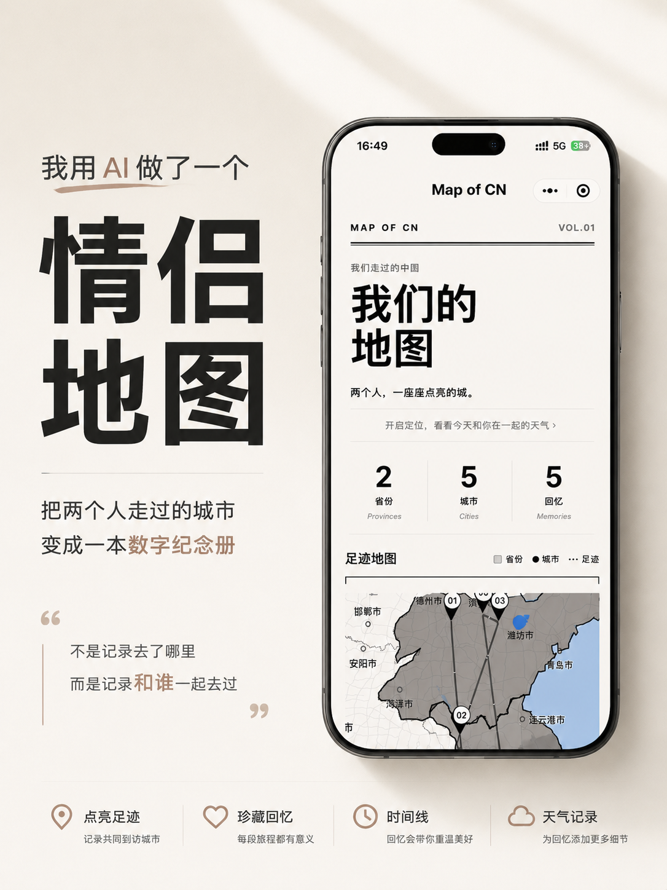
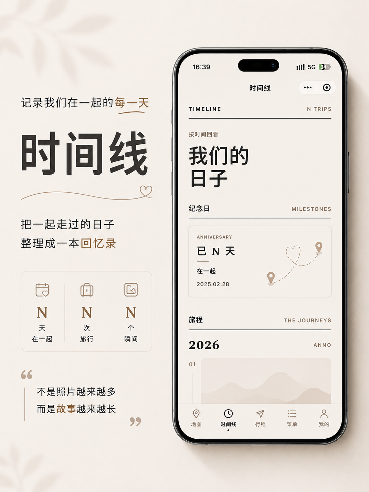
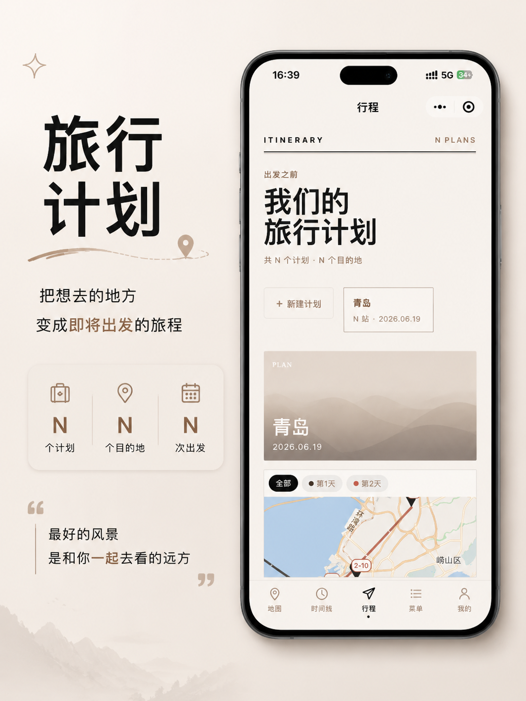
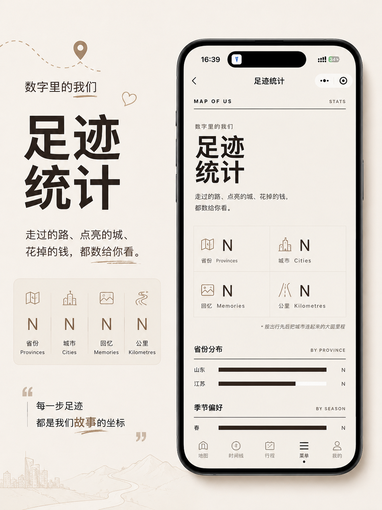
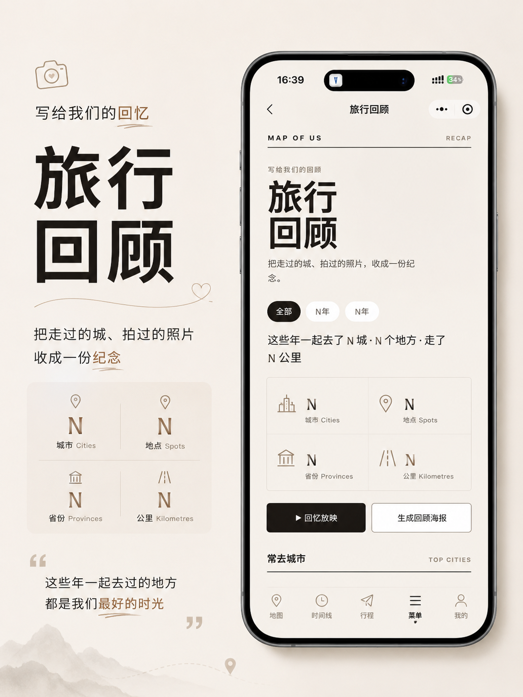
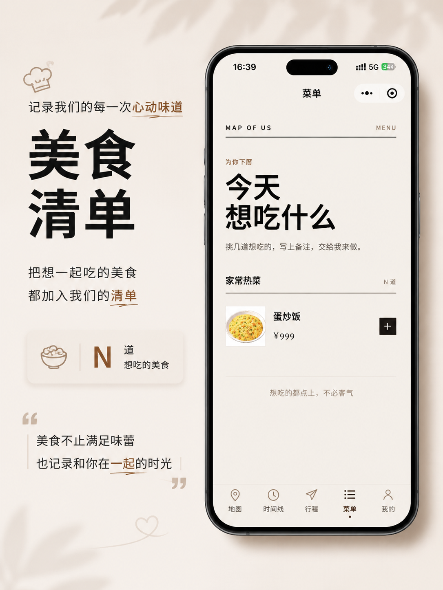

# Map of intl - 微信小程序情侣回忆地图

微信原生小程序版情侣回忆地图，用来记录两个人去过的城市、纪念日、照片、手记和行程计划。项目包含小程序前端，以及可部署到 PHP + MySQL 环境的后端接口示例。

## 项目预览

<table>
  <tr>
    <td></td>
    <td></td>
  </tr>
  <tr>
    <td></td>
    <td></td>
  </tr>
  <tr>
    <td></td>
    <td></td>
  </tr>
</table>

## 功能

- 中国地图首页：用小程序 `<map>` 组件显示城市标记和点亮省份。
- 时间线：按日期展示纪念日和旅程卡片。
- 城市详情：展示标题、引语、天气、地标、标签、照片占位和手记。
- 行程计划：维护旅行计划、停靠点、住宿和路线信息。
- 点单模块：菜品分类、购物车、下单、历史订单。
- 后台管理：PHP 单文件后台，用于管理数据、菜品、订单和上传图片。
- 微信登录：小程序端 `wx.login()` 换取 openid，后端保存用户记录。

## 目录结构

```text
miniprogram/
  app.js/json/wxss          小程序全局配置
  pages/                    首页、时间线、详情、菜单、订单、我的等页面
  utils/api.js              后端接口封装
php/
  *.php                     可部署到站点 /api/ 目录的接口文件
  admin/index.php           管理后台入口，可部署到 /admin/
  *.sql                     数据库结构与迁移脚本
  config.example.php        私有配置示例，不要直接部署为公开文件
  db.example.php            数据库连接示例，不要直接部署为公开文件
tools/
  *.js                      本地预览和图标生成脚本
```

## 后端部署

后端假设站点公开目录和私有配置目录是相邻目录，例如：

```text
/www/wwwroot/example.com/
  api/
    journeys.php
    provinces.php
    menu.php
    auth.php
    order.php
    plans.php
    route.php
    admin_api.php
  admin/
    index.php
  uploads/
/www/wwwroot/example.com_private/
  db.php
  config.php
  china-provinces.json
```

代码里的私有文件读取路径使用 `dirname(__DIR__) . '_private/...'`，所以如果你的接口部署在 `/www/wwwroot/example.com/api/`，私有目录应为 `/www/wwwroot/example.com_private/`。

### 1. 复制接口文件

把 `php/` 下的接口文件复制到你的站点 `/api/` 目录：

```text
auth.php
journeys.php
menu.php
order.php
plans.php
provinces.php
route.php
admin_api.php
```

把 `php/admin/index.php` 放到站点 `/admin/index.php`，作为网页后台入口。

### 2. 创建私有配置

在站点旁边创建私有目录，例如 `/www/wwwroot/example.com_private/`。

然后把示例文件复制为真实配置：

```text
php/config.example.php -> /www/wwwroot/example.com_private/config.php
php/db.example.php     -> /www/wwwroot/example.com_private/db.php
php/china-provinces.json -> /www/wwwroot/example.com_private/china-provinces.json
```

编辑 `config.php` 和 `db.php`，填入你自己的数据库、微信小程序 AppID/AppSecret、高德 Key 和管理员账号信息。

不要把真实的 `config.php`、`db.php`、`.env`、上传图片、数据库备份提交到仓库。

### 3. 导入数据库

按需导入 `php/` 目录下的 SQL：

1. `schema.reference.sql`：旅程、照片、手记、标签、纪念日等基础表结构参考。
2. `menu.schema.sql`：点单、菜品、订单、用户表。
3. `plans.migration.sql`、`plans.hotel.migration.sql`、`plans.hotels.migration.sql`、`plans.stay.migration.sql`、`plans.stopinfo.migration.sql`：行程计划相关表结构。
4. `wish.migration.sql`：心愿相关表结构。

如果你已经有线上数据库，先备份再导入迁移脚本。

## 小程序配置

### 1. 导入项目

1. 打开微信开发者工具。
2. 选择「导入项目」。
3. 项目目录选择仓库根目录。
4. AppID 使用你自己的微信小程序 AppID。

仓库里的 `project.config.json` 默认使用 `touristappid`，方便开源项目导入预览。正式开发和发布时，请在微信开发者工具里改成你自己的 AppID。

### 2. 配置接口域名

编辑 `miniprogram/app.js`，把 `apiBase` 改为你的接口地址：

```js
globalData: {
  apiBase: 'https://your-domain.com/api'
}
```

开发阶段可以在微信开发者工具中勾选「不校验合法域名、TLS 版本以及 HTTPS 证书」。

正式发布前，需要在微信小程序管理后台把你的域名加入 request 合法域名，例如：

```text
https://your-domain.com
```

微信登录接口会调用 `code2session`，请确保服务器可以访问微信接口，并在微信公众平台配置正确的 AppSecret 和 IP 白名单。

## 私有配置示例

`php/config.example.php` 和 `php/db.example.php` 只提供字段结构。真实部署时，私有目录中的文件应类似：

```php
<?php
return [
    'wx_appid' => 'your-wechat-mini-program-appid',
    'wx_secret' => 'your-wechat-mini-program-secret',
    'amap_key' => 'your-amap-web-service-key',
    'admin_user' => 'admin',
    'admin_pass_hash' => password_hash('change-this-password', PASSWORD_DEFAULT),
    'upload_dir' => '/www/wwwroot/example.com/uploads',
    'upload_base' => '/uploads',
];
```

## 版权声明

Copyright 2026 InfFlow.

本项目以 Apache License 2.0 授权发布。使用、复制、修改、分发本项目时，请保留版权声明和许可证声明。

## 开源协议

本项目使用 Apache License 2.0。你可以自由使用、修改、分发和商用，但需要保留版权和许可证声明；该协议同时包含专利授权条款。
